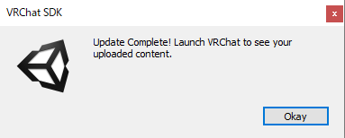
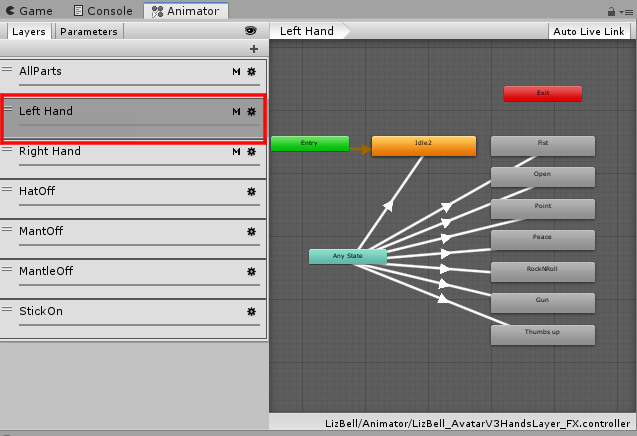

# LizBell仕様詳細および導入マニュアル

2021/02/11　アライラク

 

## 利用規約

[https://github.com/AraiRacu/Licence](https://github.com/AraiRacu/Licence) を参照してください。

アライラク(以下「制作者」)の制作した素材(以下「本件素材」)を購入・利用する全てのお客様(以下「利用者」)は、上記URLに記載する利用規約(以下「本規約」)に同意したものといたします。

 

# はじめに

本製品はAvatar2.0及びAvatar3.0それぞれのセットアップがされていますが、Avatar2.0では、一部機能が使えないため、すべての機能を利用できるAvatar3.0での利用を推奨しています。

 

本マニュアルでは混同を防ぐため、Avatar2.0の内容を[A2]、Avatar3.0の内容を[A3]で記述します。

 

# 目次

- [配布物内容](#配布物内容)
- [アップロードまでの流れ](#アップロードまでの流れ)
- [シェイプキー](#シェイプキー)
  - [プリセット表情](#プリセット表情)
  - [Avatar3\.0でのシェイプキーの入れ替え[A3]](#Avatar30でのシェイプキーの入れ替えA3)
    - [顔の表情の変更[A3]](#顔の表情の変更\[A3\])
    - [手の表情の変更[A3]](#手の表情の変更\[A3\])
  - [LisSyncの干渉防止について[A3]](#LisSyncの干渉防止について\[A3\])
- [ExMenuについて[A3]](#ExMenuについて\[A3\])
- [Constraintについて](#Constraintについて)
  - [改変の際にネジレ防止機構を利用する方法](#改変の際にネジレ防止機構を利用する方法)
  - [杖の接続について](#杖の接続について)
- [同梱プレハブ](#同梱プレハブ)
- [VRM](#VRM)
- [同梱3Dオブジェクト](#同梱3Dオブジェクト)
  - [LizBell\.fbx](#LizBellfbx)
  - [LizBellSimple\.fbx](#LizBellSimplefbx)
  - [Stick\.fbx](#Stickfbx)
    - [Humanoid化](#Humanoid化)
- [マテリアルおよびテクスチャ](#マテリアルおよびテクスチャ)
  - [UTS2\.0](#UTS20)
  - [Blender](#Blender)
  - [テクスチャ](#テクスチャ)
    - [ファイル内について](#ファイル内について)
- [その他](#その他)

 

# 配布物内容

LizBell_v1_00.zip/

　　┝Model/

　　│　┝LizBell.fbx

　　│　┝LizBellSimple.fbx

　　│　┝Stick.fbx

　　│　┝LizBell.blender

　　│　└Tex/

　　│　　　┝Body.psd

　　│　　　┝Hair.psd

　　│　　　┝Cloth.psd

　　│　　　└Stick.psd

　　┝VRM/

　　│　└LizBell.vrm

　　┝LizBell_Avatar2.unitypackage

　　┝LizBell_Avatar3.unitypackage

　　┝readme_jp.txt

　　┝readme_en.txt

　　┝Licence_GitHub

　　└LizBell_Manual

 

# アップロードまでの流れ

※Unity2018.4.20fでの方法です。

参考：【最新版】初心者向け：VRChatのアバターアップロード方法 - ASTONESS

　　　[https://astoness.com/blogs/times/how-to-upload-avatar-vrchat](https://astoness.com/blogs/times/how-to-upload-avatar-vrchat)

 

前提条件

- VRChatのアカウント取得
- Unityのアカウント取得
- Unity2018.4.20fのインストール
- 最新版のVRCSDK2[A2]またはVRCSDK3-Avatars[A3]の入手
- 本製品のダウンロードおよび解凍
- VRChatトラストシステムによるアバターアップロードの解禁

 

#### 1. Unityを起動し、新規プロジェクトを作成します

   ※Unityアカウントでのログインが必要な場合があります。

   ※Unity Hubを使用している場合、手順が異なります。

   1. Unityを起動し、プロジェクトを作成します。**Project name** に適当なプロジェクト名を入力し、**Template** を**3D** にします。入力後、**Create project** を押します。

      

       

      

   2. しばらくするとプロジェクトが作成され、Unityの画面が表示されます。

       

#### 2. Unityにパッケージをインポートします

1. **VRCSDK2**[A2]または**VRCSDK3**[A3]をインポートします。エクスプローラーからUnityの**Project** タブの**Asset** フォルダにD&Dします。その後、Import画面が開くので、**Import** 押してしばらくするとインポートされます。

   

2. **DynamicBone** があれば、ここで、インポートします。**Asset Store** のタブの購入画面などから**Import** を押し、インポートします。

   

3. 本製品の**LizBell_Avatar2.0.unitypackage**[A2]または**LizBell_Avatar3.0.unitypackage**[A3]をインポートします。操作は1.のVRCSDKをインポートとしたときと同様です。ユニティちゃんトゥーンシェーダー2.0.7.5は本パッケージに同梱しているので追加でインポートする必要はありません。

#### 3.VRCSDKにログインします

1. 上のメニューバーの**VRChat SDK** ->**Show Control Panel** でVRChatのコントロールパネルを開き、**Authentication** でログインをします。

   

   

#### 4. Sceneを開きます

1. **Project** タブの**Asset/LizBell** から**LizBell.unity**をダブルクリックで開いてください。**Hierarchy** にセットアップ済みのアバターのプレハブが用意しています。プレハブの種類については[ここ](#同梱プレハブ) を参照してください。

   

#### 5.アバターをVRChatにアップロードします

1. シーンを保存します。ここで**Ctrl+Shift+ S** で適当なシーン名で保存します。

   ※ここで別途、新規シーンで保存することをおすすめします。(改めてunitypackageをインポートするとLizBell.untiyが上書きされることがあります。)

2. ログインしたVRChatコントロールパネル内の**Builder** の右下の**Build & Publish** を押します。

   ※Scene内に複数のアバターがある場合は**Builder** でアップロードするアバターを選択してください。

   

3. しばらくすると**Game** 画面で入力画面が開くので、**Avatar Name** に適当な名前、**Sharing** の**Private** にチェック、**The above infomation~** (同意について)にチェックを入れ、**Upload** を押します。

   

4. 少し待って、画像のような表示が出ればアップロード完了です。

   

 

# シェイプキー

## プリセット表情

デフォルトでアバターに入っている表情は以下のとおりです。(**LizBell/Animation/ShapeKey**内)

 

追加でセットアップ済みのアニメーションは以下のとおりです。(**LizBell/Animation/ShapeKey/Option**内)

 

手の表情も以下のような設定しています。(**LizBell/Animation/Transform**内)

 

## Avatar3.0でのシェイプキーの入れ替え[A3]

Avatar3.0で表情を変更する手順を説明します。

 

### 顔の表情の変更[A3]

この章では、左右の手に同じ表情を割り当てることを行います。

1.**Animatorウィンドウ**を表示します。

2.**Projectウィンドウ**の**LizBell/Animator**の中からAnimatorファイル、**LizBell_AvatarV3HandsLayer_FX**を選択し、AnimatorウィンドウにAnimatorの内容を表示します。

3.AnimatorウィンドウのLayersタブを選択し、その下の**Left Hand**を選択し、左手のハンドジェスチャーのレイヤーを表示してください。

4.**Left Hand**の中にあるFist～ThumbsupのStateの中で、変更したい手の表情を選択します。この状態でInspectorウィンドウに移動するとそのStateの内容が表示されています。

5.Projectウィンドウから**LizBell/Animation/ShapeKey**内の変更したいアニメーションをInspector内の**Motion**にアタッチします。

6.次に、右手の設定をします。同じAnimatorでLayersタブに並んている**Right Hand**を選択してください。

7.Left Handと同様に変更したい手の表情のStateを選択し、Inspector内のMotionに変更するAnimationにアタッチします。

 

### 手の表情の変更[A3]

主な操作は顔の表情を変更する方法と同様です。

1.**Animatorウィンドウ**を表示します。

2.**Projectウィンドウ**の**LizBell/Animator**の中からAnimatorファイル、**LizBell_AvatarV3HandsLayer_Transform**を選択し、AnimatorウィンドウにAnimatorの内容を表示します。

3.AnimatorウィンドウのLayersタブを選択し、その下の**Left Hand**を選択し、左手のハンドジェスチャーのレイヤーを表示してください。

4.**Left Hand**の中にあるFist～ThumbsupのStateの中で、変更したい手の表情を選択します。この状態でInspectorウィンドウに移動するとそのStateの内容が表示されています。

5.Projectウィンドウから**LizBell/Animation/Transform**内の変更したいアニメーションをInspector内の**Motion**にアタッチします。

6.次に、右手の設定をします。同じAnimatorでLayersタブに並んている**Right Hand**を選択してください。

7.Left Handと同様に変更したい手の表情のStateを選択し、Inspector内のMotionに変更するAnimationにアタッチします。

 

## LisSyncの干渉防止について[A3]

Avatar3.0の機能で、ハンドジェスチャーで表情を変更しているときにリップシンクを行わない設定ができます。

 

**Projectウィンドウ**の**LizBell/Animator**の中からAnimatorファイル、**LizBell_AvatarV3HandsLayer_FX**でのRight Hand及びLeft Handの表情がアタッチされているStateに**VRC Animator Tracking Control**が刺してあり、その中の**Mouth&Jaw**の**Animation**のチェックをつけることで干渉を防止しています。

 

参照：[VRChat] Avatars3.0で表情切り替え時のまばたき干渉防止を実装する - がとーしょこらの技術録

[https://gatosyocora.hatenablog.com/entry/2020/08/09/094945](https://gatosyocora.hatenablog.com/entry/2020/08/09/094945)

 

# ExMenuについて[A3]

本製品ではAvatar3.0の機能を利用して、アバターの帽子、マント、外套、杖の表示非表示をすることができます。

これらのAnimatorの機能はAssetフォルダ内のLizBell/Animator内、LizBell_AvatarV3HandsLayer_FXで設定されています。

それぞれのオブジェクトの表示非表示はそれぞれ1つずつのレイヤーに分けて設定しています。

また、ExMenuはLizBell/ExMenu内のLizBellExMenu及びLizBellExParametersで設定されています。

 

参考：[VRChat] Avatars3.0で物を出し入れする (EmoteSwitchみたいなもの) - がとーしょこらの技術録

[https://gatosyocora.hatenablog.com/entry/2020/08/08/164516](https://gatosyocora.hatenablog.com/entry/2020/08/08/164516)

 

# Constraintについて

本製品ではUnity2018以降の機能であるConstraintを用いて

より自然な動きをできるようになりました。

 

## 改変の際にネジレ防止機構を利用する方法

本製品では外套のように腕がねじれてもそれに追従しないようなネジレ防止機構を搭載しています。

改変時に、このネジレ防止機構を利用する場合、以下の特定のボーンの子に着せる衣装のボーンを入れてください。

- ClothUpperArm.L/.R
- ClothLowerArm.L/.R
- Sleeve.L/.R

 

## 杖の接続について

プレハブでは**ParentConstraint**を用いて手に接続させています。

**hand.R**の子にある**StickParent**という空のゲームオブジェクトに接続させることで右手に追従させています。

参考：https://twitter.com/higrashi/status/1246269280670191616

 

# 同梱プレハブ

本製品には以下のプレハブを用意しています。それ以外については改変をお願いします。

- **(Avatar3.0)LizBell** (推奨)
- (Constraint)補助ボーンあり
  
- (ExMenu)衣装着脱機能あり
  - (LipSync)表情のリップシンク干渉の防止機能
  
- **(Avatar3.0)LizBell_Simple** 
- (Constraint)補助ボーンなし
  
- (ExMenu)衣装着脱機能あり
  - (LipSync)表情のリップシンク干渉の防止機能
  
- **(Avatar2.0)LizBell**
- (Constraint)補助ボーンあり
  
- (ExMenu)衣装着脱機能なし
  
- **(Avatar2.0)LizBell_Simple** 
- (Constraint)補助ボーンなし
  
- (ExMenu)衣装着脱機能なし

 

# VRM

本製品にはVRChat以外のVRSNS等で扱いやすいVRMも同梱しています。規約の範囲内での利用が可能です。

ポリゴン数の削減等の処理はしてませんので、プラットフォームによって利用できないことがあることをご了承ください。

 

# 同梱3Dオブジェクト

## LizBell\.fbx

補助ボーンを使用することを前提としたリグ構成となっています。

扱うにはConstraintについての知識が必要ですが、当製品の能力を最大限利用することができます。

 

- ポリゴン数：62554
- オブジェクト数：12
- ボーン数：277
- マテリアル数：6
- シェイプキー
  - Body
    - リップシンク用：19
    - 表情用：61
  - body(きせかえ用の各部の縮小など)：9
  - ClothMain(マント着用時の襟の位置)：1
  - Mantle(マント着用時の襟の位置)：1

 

## LizBellSimple\.fbx

補助ボーンが必要のない一般的な構成になっています。

改変がLizBell.fbxに比べ、補助ボーンがないため簡単です。

ただし、外套が不自然な変形をしたり、関節がねじ切れてしまうことがあります。

 

- ポリゴン数：62554
- オブジェクト数：12
- ボーン数：277
- マテリアル数：6
- シェイプキー
  - Body
    - リップシンク用：19
    - 表情用：61
  - body(きせかえ用の各部の縮小など)：9
  - ClothMain(マント着用時の襟の位置)：1
  - Mantle(マント着用時の襟の位置)：1

 

## Stick\.fbx

- ポリゴン数：2408
- オブジェクト数：1
- ボーン：なし
- マテリアル数：1

 

### Humanoid化

ブレンダー等でfbxファイルを改変し、Unityで改めてHumanoid化を行う際に注意することがあります。

Indexコントローラーを使用する際に、自然な手の形になるようにfbxの時点で調整を施しています。しかし、UnityでHumanoid化するときに、自動的に変形してしまうので、リセットをする必要があります。

Humanoidの設定画面において、以下の画像のように**Reset** を押します。指のボーンが赤くなり、Tポーズではないという警告が出ますが、そのまま**Done** を押してHumanoid化を行います。

前髪のボーンが自動で顎のボーンになってしまっている場所も消しておいてください。

 

# シェーダーおよび改変用のファイル

## UTS2\.0

ユニティ・テクノロジーズ・ジャパン合同会社のユニティちゃんトゥーンシェーダー 2.0 (UTS2.0) Ver.2.0.7.5 を使用しています。UTS2.0.7.5 は本UnityPackageに同梱しています。 

「ユニティちゃんトゥーンシェーダー 2.0」は、UCL2.0（ユニティちゃんライセンス 2.0）で提供されます。 ユニティちゃんライセンスについては、以下を参照してください。 

UCL2.0 [http://unity-chan.com/contents/guideline/](http://unity-chan.com/contents/guideline/)

 

## Blender

本製品では改変用にバージョン2.90.0で制作したBlenderファイルも同梱しています。

Blender内で補助ボーンをセッティングしています。

タイムライン上の0フレームでTポーズ、1フレームでAポーズになります。

 

## テクスチャ

本製品にはpsdファイルとして以下のテクスチャのデータを同梱しています。

- **Body.psd**：素体、顔
- **Hair.psd**：髪の毛、耳、尻尾
- **Cloth.psd**：衣装
- **Stick.psd**：杖

 

### ファイル内について

Stick.psd以外のそれぞれのpsdファイルにはレイヤーが3つのフォルダに別れています。

- **Mask**：UTS2.0で用いるマスクがまとまっています。
- **Modification**：簡単な改変用に部位や同色でレイヤーまとめたレイヤーがあるフォルダです。
- **Edit**：影やハイライトなどそれぞれが1つずつのレイヤーに分かれたフォルダです。詳細な色の改変をする際に利用してください。

 

# その他

その他、疑問やバグなどがあれば以下の連絡先に連絡をお願いします。 

アライラク (Twitter : [@AraiRacu](https://twitter.com/AraiRacu)) 

 

# リリースノート

2021/02/11 初稿